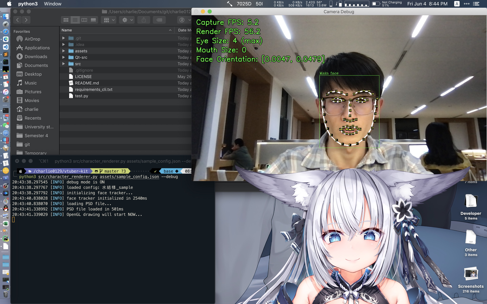

# vtuber-kit

## 命令行模式运行方法

1. 安装依赖

    `pip3 install -r requirements_cli.txt`

2. 查阅 `assets/sample_config.json` 来获取配置文件样例，主要看一下文件路径的部分，等会你可能需要修改，里面的属性应该很好理解（指那些文件路径，复杂的不用管）。你可以直接用这个样例配置文件（由于里面的数据对应我用的模型，就先得问我要~~萝莉~~模型）或自己写一个

3. 准备必要数据
    1. 用电脑摄像头拍一张你正常使用电脑的照片。保持正常的头部朝向（作为后续的面部朝向判断基准）并***张开***眼睛和嘴巴，不要张太大，差不多就行，因为你要让萝莉张开嘴和眼睛到最大的话也得做这个动作，防止别人看你在张牙舞爪
    2. 同样地，再拍一张照片，此时***闭上***眼睛和嘴巴
    3. 下载 `shape_predictor_68_face_landmarks.dat`，你可以从[这里](http://dlib.net/files/shape_predictor_68_face_landmarks.dat.bz2)获得它。
    4. 准备一张~~萝莉~~ or 任意 `psd` 图片，需要按深度分图层，以及每个图层的深度信息，深度信息写在配置文件中（见配置文件样例，数字越小越靠近你）如果你没有这种图片，你可以自己画 or 找别人画 or 问我要
    5. 将以上 4 个文件放到你找得到的地方（建议放在 `assets` 目录下）
    
4. 编辑配置文件，将样例配置文件复制一份（以下配置中的路径均建议使用相对路径）
    1. 将 `std_face_open_image_path` 的值改为你张开眼睛和嘴巴的图片的位置
    2. 将 `std_face_closed_image_path` 的值改为你闭上眼睛和嘴巴的图片的位置
    3. 将 `face_landmarks_path` 的值改为你下载的 `shape_predictor_68_face_landmarks.dat` 文件的位置
    4. 将 `psd_file_path` 的值改为 `psd` 图片的位置
    5. 将 `camera_path` 改为你电脑摄像头的路径，一般来说保持 `0` 即可，除非你电脑有多个摄像头
    6. 深度信息等根据 `psd` 人物的不同酌情修改（要是用我给的萝莉和样例配置文件的话就不用改了）
    7. 其他设置以后再说🙄
    
5. 使用合适的命令行参数来启动项目

    1. `config`: 指定 `json` 配置文件路径（必选）
    2. `--debug, -d`: 开启面部跟踪调试画面（可选）

    比如在项目***根目录***（注意工作路径）下运行样例可以这么操作： `python3 src/character_renderer.py assets/sample_config.json` （你可以使用 `--debug` 参数来打开摄像头调试窗口）

    ```
    usage: character_renderer.py [-h] [-d] config
    
    positional arguments:
      config                path to the config file (json)
    
    optional arguments:
      -h, --help            show this help message and exit
      -d, --debug           toggle debug mode (show face landmarks)
    ```

## 运行图例




## Acknowledgements

1. [RimoChan/Vtuber_Tutorial: 【教程】从零开始的自制Vtuber！ (github.com)](https://github.com/RimoChan/Vtuber_Tutorial)

